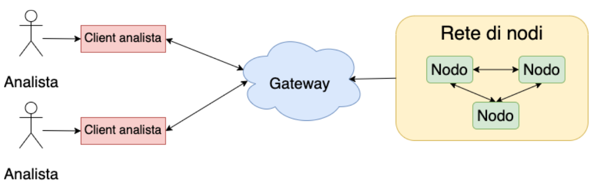

# Pollution Monitoring

A distributed system for air pollution monitoring written in Java. Developed for the course "Distributed and Pervasive Systems" @ University of Milan.

The documentation of the project can be found [here](documentation.pdf) (italian).

Overview of the system architecture:

The repository structure follows the architecture of the system. There are 3 main submodules, one for each component of the system:

* Red block = client
* Blue block = gateway
* Green block = node
